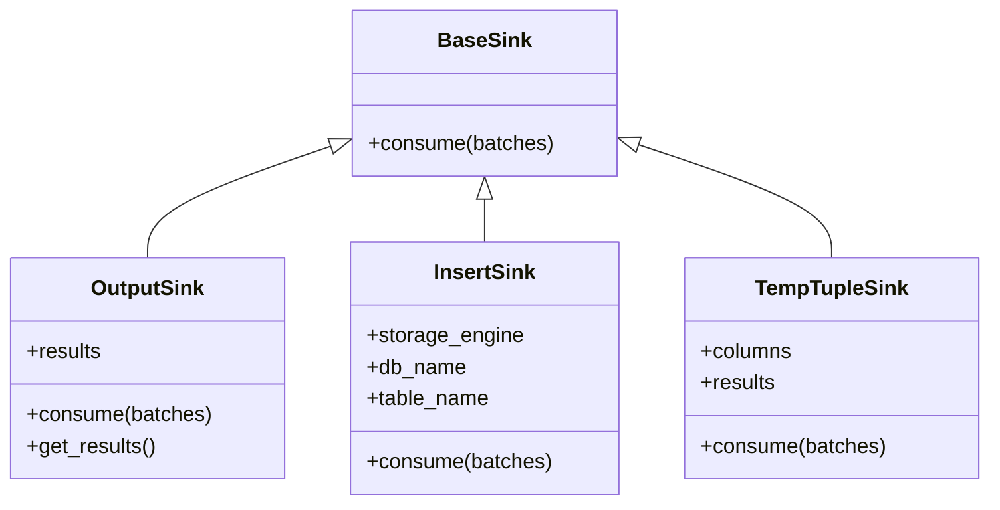

# Executor API Reference

See [Configuration](../explanation/configuration.md) for details on global settings (batch size, etc.).

## Main Class

### Executor
Orchestrates batch-wise scan, filter, project, and sink pipelines for query execution.

#### Methods

```python
def run_pipeline(db_name, table_name, batch_size, predicate, columns, sink)
```
Runs a scan/filter/project pipeline and sends results to the specified sink.

- **db_name**: Name of the database
- **table_name**: Name of the table
- **batch_size**: Number of rows per batch
- **predicate**: Function for filtering rows (optional)
- **columns**: List of columns to project (optional)
- **sink**: Sink object to consume results

## Sinks

### BaseSink
Abstract base class for all sinks.

```python
class BaseSink:
    def consume(self, batches):
        raise NotImplementedError
```

### OutputSink
Collects results as a list of dictionaries.

```python
class OutputSink(BaseSink):
    def consume(self, batches): ...
    def get_results(self): ...
```

### InsertSink
Appends results to a table in the storage engine.

```python
class InsertSink(BaseSink):
    def __init__(self, storage_engine, db_name, table_name): ...
    def consume(self, batches): ...
```

### TempTupleSink
Collects results as a list of tuples (for testing).

```python
class TempTupleSink(BaseSink):
    def __init__(self, columns): ...
    def consume(self, batches): ...
```

#### Class Diagram


## Batch Operations

```python
def filter_batches(batches, predicate)
```
Filters batches of rows by a predicate.

- **batches**: Iterator of row batches
- **predicate**: Function to filter rows

```python
def project_batches(batches, columns)
```
Projects batches of rows to a subset of columns.

- **batches**: Iterator of row batches
- **columns**: List of columns to project

## Example Usage
```python
from dbms.executor.executor import Executor
from dbms.executor.sinks import OutputSink

executor = Executor(storage_engine)
sink = OutputSink()
executor.run_pipeline(
    db_name="mydb",
    table_name="users",
    batch_size=100,
    predicate=lambda row: row["age"] > 30,
    columns=["name", "email"],
    sink=sink,
)
results = sink.get_results()
```
