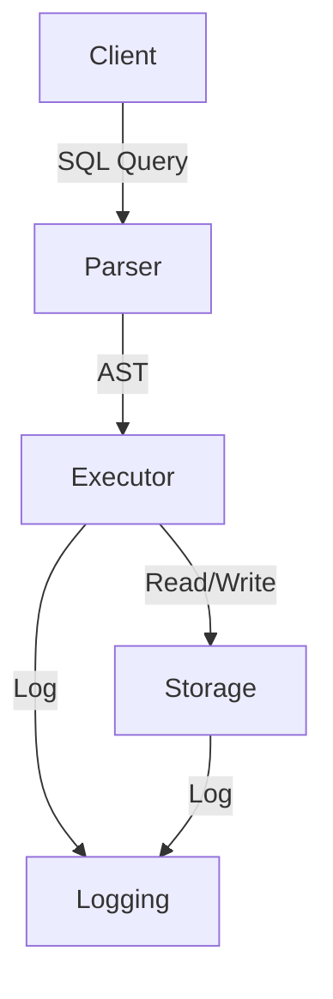

# Architecture Overview

This document provides a high-level overview of the DBMS architecture.

## Components
- **Storage Backend:** Manages on-disk data and metadata ([details](./storage.md)).
- **SQL Parser:** Parses SQL queries into internal representations using PLY ([details](../api/parser.md)).
- **Query Executor:** Executes parsed queries ([details](../api/executor.md)).
- **Logging:** Centralized logging for all backend operations ([details](./logging.md)).

## Data Flow Diagram

## Related Docs
- [Storage Backend](./storage.md)
- [Logging](./logging.md)
