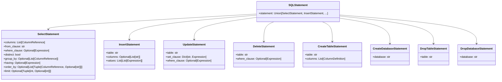
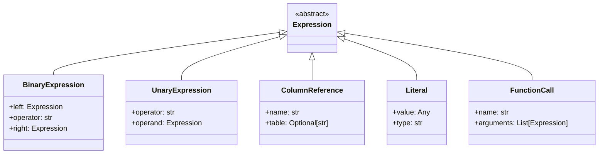
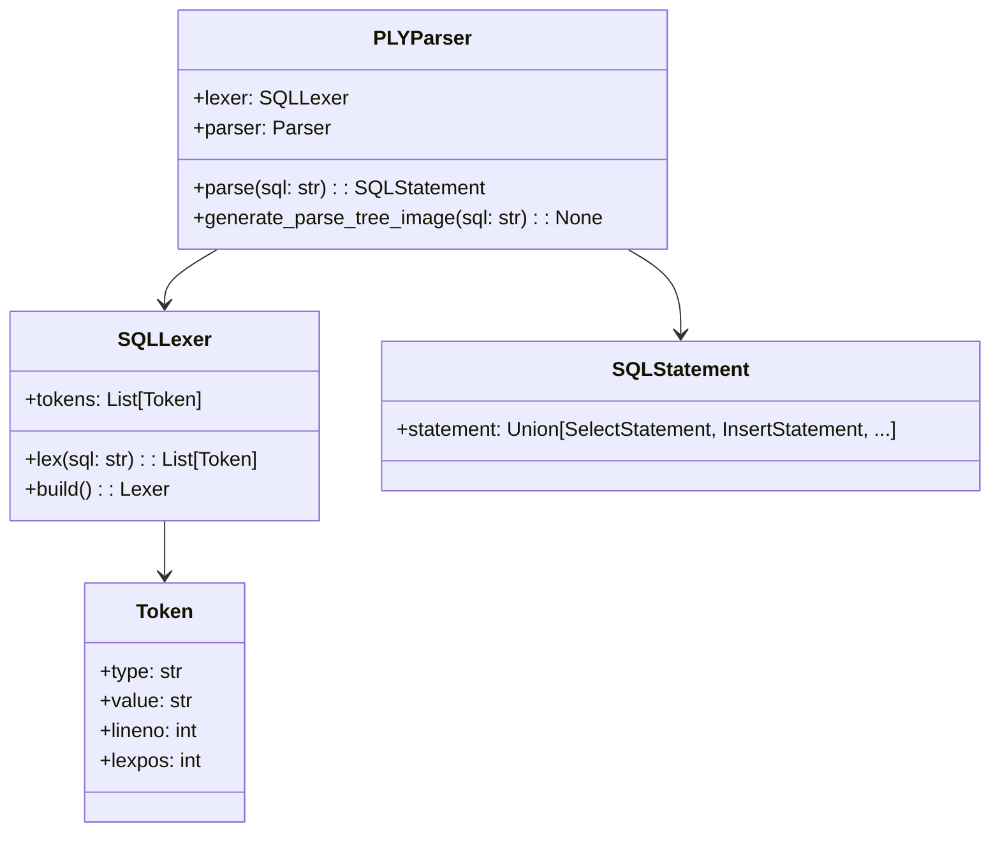

# SQL Parser Overview

---

## Introduction

The SQL Parser is a core component of the DBMS that transforms human-readable SQL queries into structured Abstract Syntax Trees (AST) that can be processed by the query executor. Built using [PLY (Python Lex-Yacc)](https://www.dabeaz.com/ply/), it provides robust parsing capabilities with comprehensive error handling and debugging features.

## Key Features

### 🎯 **Comprehensive SQL Support**
- **DML Operations**: SELECT, INSERT, UPDATE, DELETE
- **DDL Operations**: CREATE TABLE, CREATE DATABASE, DROP TABLE, DROP DATABASE
- **Complex Queries**: JOINs, subqueries, aggregate functions, GROUP BY, HAVING
- **Expressions**: Arithmetic, logical, and comparison operators

### 🔧 **Advanced Features**
- **Visual Debugging**: Parse tree visualization using Graphviz
- **Error Recovery**: Detailed syntax error reporting with line/column information
- **Extensible Design**: Easy to add new SQL features and grammar rules
- **Performance Optimized**: LALR(1) parsing algorithm for efficient processing

### 📊 **Supported SQL Syntax**

```sql
-- Basic SELECT with WHERE
SELECT name, age FROM users WHERE age > 18;

-- Complex SELECT with aggregations
SELECT department, COUNT(*) as emp_count, AVG(salary) as avg_salary
FROM employees
WHERE status = 'active'
GROUP BY department
HAVING COUNT(*) > 5
ORDER BY avg_salary DESC
LIMIT 10;

-- INSERT with multiple values
INSERT INTO users (name, email, age)
VALUES ('Alice', 'alice@example.com', 25),
       ('Bob', 'bob@example.com', 30);

-- UPDATE with expressions
UPDATE products
SET price = price * 1.1,
    updated_at = CURRENT_TIMESTAMP
WHERE category = 'electronics';

-- CREATE TABLE with constraints
CREATE TABLE users (
    id INTEGER PRIMARY KEY,
    name VARCHAR(255) NOT NULL,
    email VARCHAR(255) UNIQUE,
    age INTEGER CHECK (age >= 0),
    created_at TIMESTAMP DEFAULT CURRENT_TIMESTAMP
);
```

## Architecture

### Two-Stage Processing

1. **Lexical Analysis (Lexer)**
   - Converts SQL text into tokens
   - Handles keywords, identifiers, literals, operators
   - Processes comments and whitespace
   - Provides detailed error reporting for lexical issues

2. **Syntax Analysis (Parser)**
   - Converts tokens into Abstract Syntax Tree
   - Validates SQL grammar rules
   - Generates structured AST nodes
   - Handles operator precedence and associativity

### AST Structure

The parser generates a rich Abstract Syntax Tree (AST) that represents the structure of SQL queries. Each node in the AST corresponds to a specific SQL construct and contains all the necessary information for query execution.

#### Statement Nodes

```python
class SQLStatement:
    """Root wrapper for all SQL statements"""
    statement: Union[SelectStatement, InsertStatement, UpdateStatement,
                    DeleteStatement, CreateTableStatement, CreateDatabaseStatement,
                    DropTableStatement, DropDatabaseStatement]

class SelectStatement:
    """Represents SELECT queries"""
    columns: List[ColumnReference]          # Selected columns
    from_clause: str                        # Table name
    where_clause: Optional[Expression]      # WHERE condition
    distinct: bool                          # DISTINCT modifier
    group_by: Optional[List[ColumnReference]] # GROUP BY columns
    having: Optional[Expression]            # HAVING condition
    order_by: Optional[List[Tuple[ColumnReference, Optional[str]]]] # ORDER BY
    limit: Optional[Tuple[int, Optional[int]]] # LIMIT and OFFSET

class InsertStatement:
    """Represents INSERT operations"""
    table: str                             # Target table
    columns: Optional[List[str]]           # Column names (optional)
    values: List[List[Expression]]         # Values to insert

class UpdateStatement:
    """Represents UPDATE operations"""
    table: str                             # Target table
    set_clause: Dict[str, Expression]      # Column = value pairs
    where_clause: Optional[Expression]     # WHERE condition

class DeleteStatement:
    """Represents DELETE operations"""
    table: str                             # Target table
    where_clause: Optional[Expression]     # WHERE condition

class CreateTableStatement:
    """Represents CREATE TABLE operations"""
    table: str                             # Table name
    columns: List[ColumnDefinition]        # Column definitions

class CreateDatabaseStatement:
    """Represents CREATE DATABASE operations"""
    database: str                          # Database name

class DropTableStatement:
    """Represents DROP TABLE operations"""
    table: str                             # Table name

class DropDatabaseStatement:
    """Represents DROP DATABASE operations"""
    database: str                          # Database name
```

#### Expression Nodes

```python
class BinaryExpression:
    """Represents binary operations (+, -, *, /, =, !=, <, >, etc.)"""
    left: Expression                       # Left operand
    operator: str                          # Operator symbol
    right: Expression                      # Right operand

class UnaryExpression:
    """Represents unary operations (NOT)"""
    operator: str                          # Operator symbol
    operand: Expression                    # Operand

class ColumnReference:
    """Represents column references"""
    name: str                              # Column name
    table: Optional[str]                   # Table name (optional)

class Literal:
    """Represents literal values"""
    value: Any                             # Literal value
    type: str                              # Data type (string, number, boolean)

class FunctionCall:
    """Represents function calls (COUNT, SUM, AVG, etc.)"""
    name: str                              # Function name
    arguments: List[Expression]            # Function arguments
```

#### Definition Nodes

```python
class ColumnDefinition:
    """Represents column definitions in CREATE TABLE"""
    name: str                              # Column name
    data_type: str                         # Data type (INTEGER, VARCHAR, etc.)
    nullable: bool                         # NULL constraint
    primary_key: bool                      # PRIMARY KEY constraint
    default_value: Optional[Any]           # DEFAULT value
```

## Class Diagrams

### AST Statement Hierarchy


### AST Expression Hierarchy


### Parser Components


## Usage Examples

### Basic Parsing

```python
from dbms.parser.parser import PLYParser

parser = PLYParser()

# Parse a simple query
sql = "SELECT name, age FROM users WHERE age > 18"
ast = parser.parse(sql)

# Access parsed components
select_stmt = ast.statement
print(f"Table: {select_stmt.from_clause}")
print(f"Columns: {[col.name for col in select_stmt.columns]}")
print(f"Where condition: {select_stmt.where_clause}")
```

### Error Handling

```python
try:
    ast = parser.parse("SELECT * FROM users WHERE age >")
except ParserError as e:
    print(f"Syntax error: {e}")
    # Output: Syntax error at '>' at line 1, column 25
```

### Parse Tree Visualization

```python
from dbms.common import config

# Enable visualization
config.generate_parse_tree_images = True

parser = PLYParser()
sql = "SELECT name, age FROM users WHERE age > 30"
ast = parser.parse(sql)  # Automatically generates parse tree image
```

## Performance Characteristics

### Parsing Speed
- **Typical Queries**: < 1ms for simple queries
- **Complex Queries**: 1-5ms for queries with multiple joins and subqueries
- **Large Queries**: 5-10ms for queries with hundreds of columns

### Memory Usage
- **AST Size**: ~2-5KB per typical query
- **Parser State**: Minimal memory overhead
- **Parse Tree Images**: Additional 10-50KB per visualization

### Optimization Tips
- Reuse parser instances when possible
- Disable parse tree generation in production
- Use `reset()` method to clear state between queries

## Extending the Parser

### Adding New SQL Features

1. **Define Tokens** in `src/parser/lexer.py`:
   ```python
   def t_NEW_KEYWORD(t):
       r'NEW_KEYWORD'
       return t
   ```

2. **Add Grammar Rules** in `src/parser/parser.py`:
   ```python
   def p_new_statement(p):
       """new_statement : NEW_KEYWORD expression"""
       p[0] = NewStatement(expression=p[2])
   ```

3. **Create AST Nodes** in `src/parser/ast.py`:
   ```python
   class NewStatement(ASTNode):
       def __init__(self, expression):
           self.expression = expression
   ```

4. **Add Tests** in `tests/unit/test_parser.py`

### Best Practices

- Follow PLY naming conventions (`p_` prefix for parser rules)
- Test all grammar alternatives thoroughly
- Provide meaningful error messages
- Update documentation for new features
- Maintain backward compatibility

## Debugging and Troubleshooting

### Common Issues

1. **Import Errors**
   ```bash
   pip install ply  # Install PLY dependency
   ```

2. **Parse Tree Generation**
   ```bash
   # Install Graphviz for visualization
   # Ubuntu/Debian
   sudo apt-get install graphviz

   # macOS
   brew install graphviz

   # Windows
   # Download from https://graphviz.org/download/
   ```

3. **Performance Issues**
   - Disable parse tree generation in production
   - Reuse parser instances
   - Consider query complexity

### Debugging Tools

1. **Print Statements**: Each parser rule includes debug output
2. **Parse Tree Images**: Visual representation of parsed queries
3. **Error Context**: Detailed error messages with position information
4. **Test Suite**: Comprehensive tests for all features

## Related Resources

### Documentation
- **[API Reference](../api/parser.md)**: Complete API documentation
- **[PLY Documentation](https://www.dabeaz.com/ply/)**: Official PLY docs
- **[Python Lex-Yacc Tutorial](https://www.dabeaz.com/ply/ply.html)**: PLY tutorial

### Standards and References
- **[SQL Standard](https://www.iso.org/standard/63555.html)**: ISO/IEC 9075
- **[AST Design Patterns](https://en.wikipedia.org/wiki/Abstract_syntax_tree)**: AST concepts
- **[LALR Parser](https://en.wikipedia.org/wiki/LALR_parser)**: Parsing algorithm

### Tools and Libraries
- **[Graphviz](https://graphviz.org/)**: Parse tree visualization
- **[PLY GitHub](https://github.com/dabeaz/ply)**: Source code and examples

## Testing

The parser includes comprehensive tests covering:

- All SQL statement types
- Complex expressions and operators
- Error conditions and edge cases
- Performance with large queries
- Parse tree generation

### Running Tests

```bash
# Run all parser tests
python -m pytest tests/unit/test_parser.py -v

# Run with coverage
python -m pytest tests/unit/test_parser.py --cov=dbms.parser --cov-report=html

# Run specific test categories
python -m pytest tests/unit/test_parser.py::test_select_statements -v
python -m pytest tests/unit/test_parser.py::test_error_handling -v
```

## Future Enhancements

### Planned Features
- **Stored Procedures**: Support for procedural SQL
- **Triggers**: Database trigger syntax
- **Views**: CREATE/DROP VIEW statements
- **Indexes**: CREATE/DROP INDEX statements
- **Transactions**: BEGIN, COMMIT, ROLLBACK

### Performance Improvements
- **Parallel Parsing**: Multi-threaded parsing for large queries
- **Caching**: AST caching for repeated queries
- **Optimization**: Query optimization hints

### Developer Experience
- **IDE Integration**: Better error reporting for IDEs
- **Query Validation**: Pre-execution validation
- **Schema Awareness**: Type checking against database schema

---

For detailed API documentation, see the [Parser API Reference](../api/parser.md).
